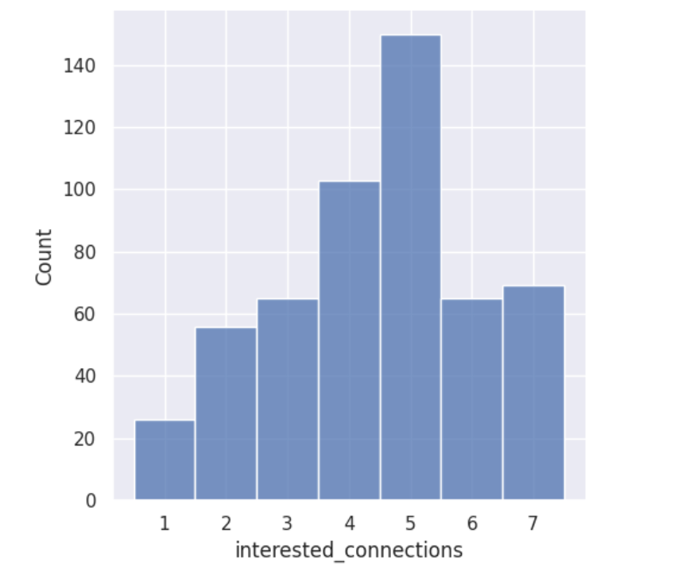
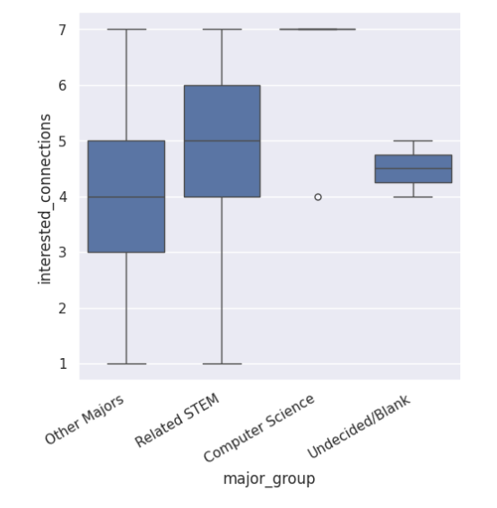
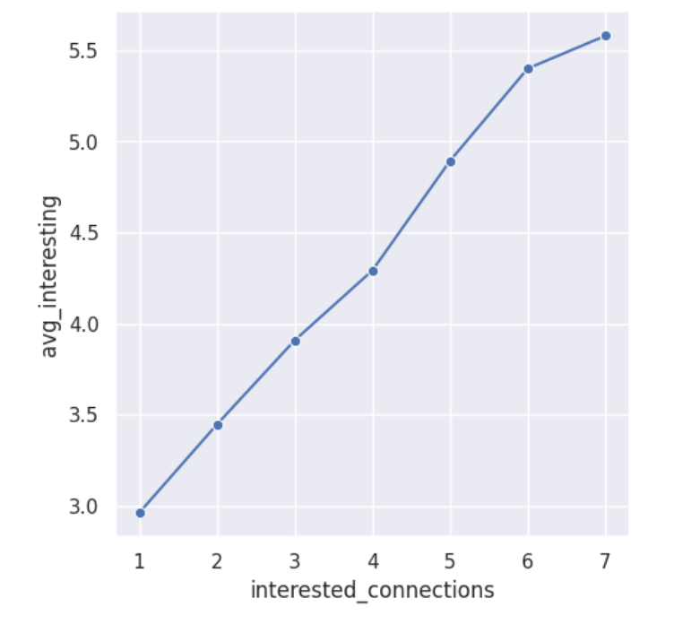

---
# Do not edit the text between these lines!
layout: default
---
# COMP 110 EX09

## Analysis
To start our analysis, we seperated columns that were relevant to my idea using select(). We also used functions such as head(), convert_columns_to_int(), and major_group() to further organize the data and get a general idea of what we would be analyzing. 

Next we used count() to see how many students selected each response (scale from 1-7) for the interested_connections question. We noticed that there were more responses ranging from 5-7 than 1-3, demonstrating some interest in the idea of outside connections to the class.

*Figure 1: Screenshot of counts from the notebook*

We then visualized these counts using a histogram to better see the connection.

*Figure 2: Visualization of the counts in a histogram*

We also visualized the relationship between interested_connection answers and major groups using box and whisker plots, to see if only CS majors would be interested in the optional exercises, or if other majors would also be interested.

*Figure 3: Visualization of relationship between major groups and interested_connection answers using box & whisker plots*

Finally, we visualized the relationship between interest in the class and interest in outside connections, by creating a line plot comparing interested_connections answers to average interesting answers. 

*Figure 4: Visualization of relationship between ratings of interest in class and outside connections*

## Conclusion
We believe the data does relatively support our idea, and we recommend that these optional exercises are added. The first visualization of counts shows a higher concentration of students that ARE interested in how CS connects with other fields. The second visualization of major groups shows an incredibly strong interest from CS students, whereas other major groups box and whisker plots show they are less interested, although most (besides the "other majors" category) are typically above the average in mean and range. Finally, the third visualization suggests that students who are interested in cross-field connections also find the course more interesting overall, which supports the idea that adding these exerciess would align with what engaged students already value in the course. 

The potential costs and downsides of adopting this idea comes in the creation of these exercises by professors and TAs, however, by keeping the exercises optional and potentially providing answer keys to them, no stakeholders are negatively impacted after the first semester (as exercises can be reused). 

Potential extensions or refinements to our idea would include making these exercises mandatory, however then you run into issues of grading work & certain students being less engaged with the class overall due to their interests not being represented, potentially negatively impacting stakeholders.